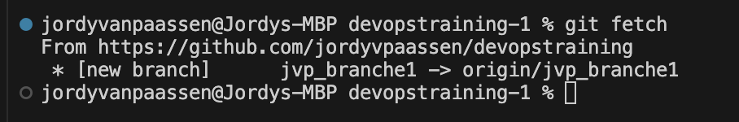

# devopstraining
Training for DevOps

#how to make a change

#when you created a branche but het did'nt come to your vs code type git fetch

https://developer.hashicorp.com/_next/image?url=https%3A%2F%2Fcontent.hashicorp.com%2Fapi%2Fassets%3Fproduct%3Dtutorials%26version%3Dmain%26asset%3Dpublic%252Fimg%252Fterraform%252Fautomation%252Ftfc-gh-actions-workflow.png%26width%3D1656%26height%3D469&w=3840&q=75

